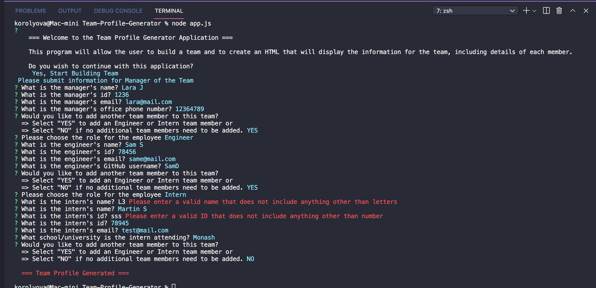
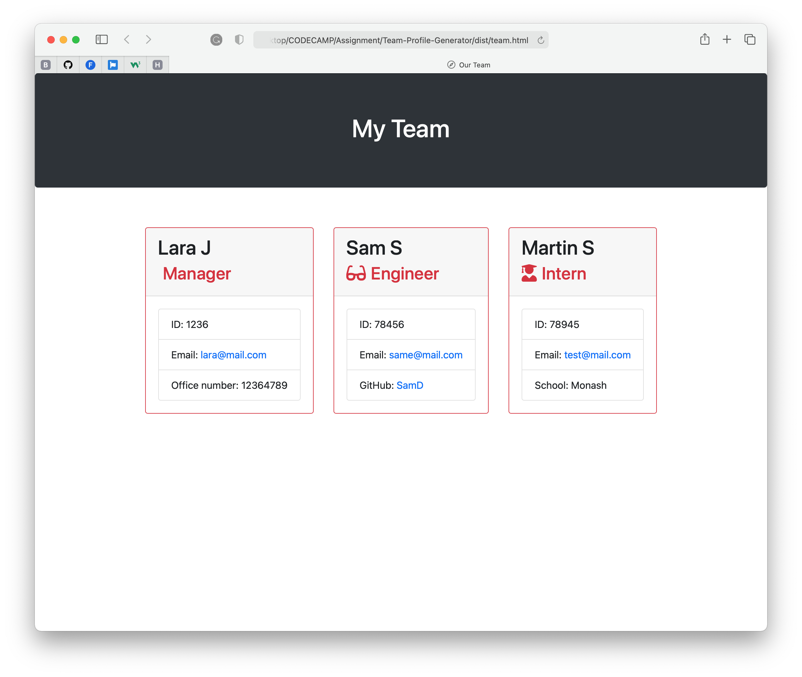

# Team-Profile-Generator

  
Table of Contents

  <ol>
    <li><a href="#description">Description</a></li>
    <li><a href="#features">Features</a></li>
    <li><a href="#technical-part">Technical Part</a>
        <ul>
            <li><a href="#demo">Demo</a></li>
            <li><a href="#installation">Installation</a></li>
            <li><a href="#usage">Usage</a></li>
            <li><a href="#contributing">Contributing</a></li>
        </ul>
    </li>
    <li><a href="#questions">Questions</a></li>
    <li><a href="#license">License</a></li>
    <li><a href="#notes">Notes</a></li>
  </ol>

## Description

A command-line application that generates an HTML webpage with information about employees from user's input using the Inquirer package.

## Features

- JavaScript
- Node.js
- npm
- [Jest](https://www.npmjs.com/package/jest)
- [Inquirer](https://www.npmjs.com/package/inquirer)
- Bootstrap

## Technical Part

### _Demo_

The following [video](https://drive.google.com/file/d/1mATOfX9q1x2utXSL0I3UAzbhUCrHPQFs/view?usp=sharing) demonstrates the functionality of the Team Profile Generator.

This [video](https://drive.google.com/file/d/1j6cgTle9vS4-oakUW3zNsA7ypZst4dNH/view?usp=sharing) demonstrates how all tests are passed from the command line of the Team Profile Generator.

The screenshots below show an example of HTML file generated by this application:

     Terminal Command Lines

    Demo Example

### _Installation_

1. Download or clone repository
2. [**<text style="color: green">Node.js</text>**](https://nodejs.org/en/about/) is required to run the application
3. Run `npm install` to install the required npm packages

### _Usage_

- Application is started by using the following command in the terminal:

  `node app.js`

- The user will be prompted for information to select employee type

  - Manager (only one is allowed to be added)
  - Engineer (any number)
  - Intern (any number)

- All employee will be asked the following information, all prompts are validated to ensure appropriate input to generate the correct output

  - Name
  - ID
  - Email

- Depending on employee role, additional prompts are presented

  - Manager -> Office number
  - Engineer -> GitHub username
  - Intern -> School

- Then a team.html page will be generated in the output directory, that displays the information about the team.

- Enjoy!

### _Contributing_

Pull requests are welcome. For major changes, please open an issue first to discuss what you would like to change, so I learn and understand it better.

Please make sure to update tests as appropriate, if applicable.

## Questions

- Checkout my [GitHub profile](https://github.com/KorolyovaLara)
- Any additional questions or feedback, feel free to [send an email](mailto:larakorolyova@gmail.com).

## License

Copyright (c) [Larysa Korolyova](https://www.linkedin.com/in/korolyova/). All rights reserved.

Licensed under the [MIT](https://github.com/KorolyovaLara/README-Generator/blob/main/LICENSE) license.

---

### Notes

Quote that recently inspired me:

> You always pass failure on the way to success. -_Mickey Rooney_

---

© 2021 L Korolyova
